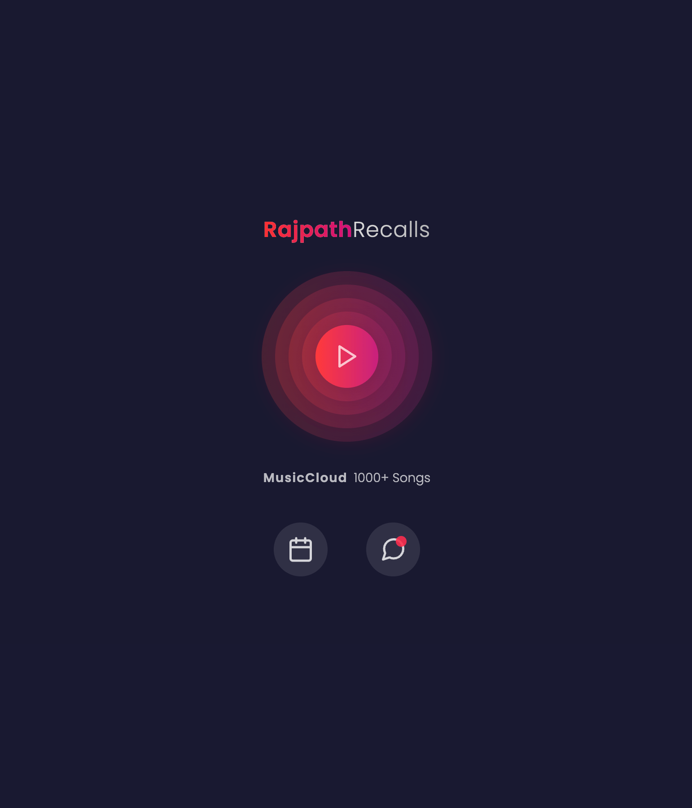

# 📻 Rajpath Recalls

<p>
  
  <a href="https://github.com/emanuelchristo" target="_blank">
    
  </a>
  <a href="https://instagram.com/emanuel.christo" target="_blank">
    
  </a>
</p>

> This is a web app for Rajpath Recalls online radio by NIT Calicut

### ⭐️ [Live website](https://rajpath-recalls.ecris.in/)

## 🏙 Screenshots



## 💿 Usage

```sh
# install dependencies
$ npm install

# dev server
$ npm run dev

# build
$ npm run build

# serve
$ npm run serve
```

## 🌳 Environment Variables

Set `firebaseConfig` in `src/App.svelte`

## 🧑‍💻 Author

- [Emanuel Christo](https://ecris.in)
